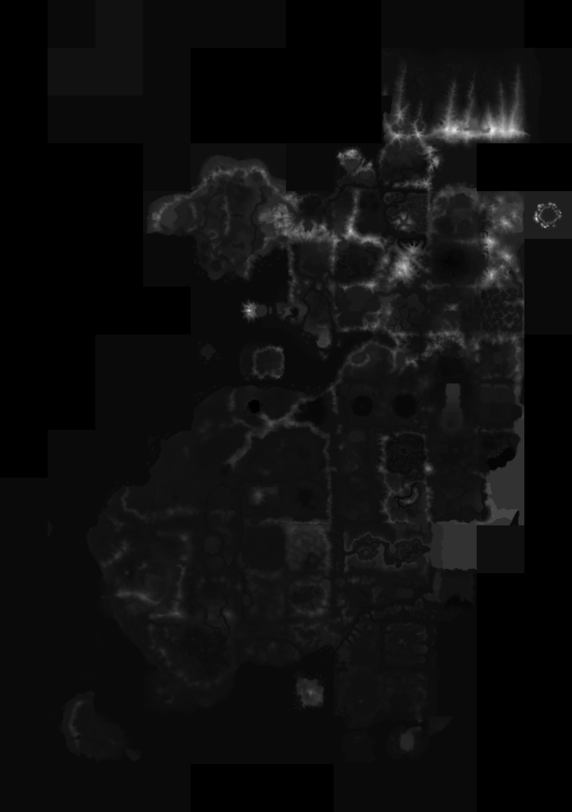

# L2TerrainExtractor

> **Lineage 2 Terrain Data Extractor**

Extract complete terrain data from encrypted Lineage 2 `.utx` and `.unr` packages including heightmaps, splatmaps, detail maps, terrain textures, and metadata. Features automatic tile detection, XOR decryption for Ver 111/121+ packages, and organized output with per-tile metadata.

[](https://opensource.org/licenses/MIT)
[](https://openjdk.org/)
[](https://gradle.org/)



## Features

- **Complete Terrain Extraction** - Heightmaps, splatmaps, detail maps, terrain textures, and metadata
- **Automatic Decryption** - Handles Lineage 2 Ver 111 and Ver 121+ XOR encryption
- **Smart Tile Detection** - Automatically finds G16 heightmap data using marker pattern detection
- **Layer-Preserving Splatmaps** - Exports blend maps with original layer numbering for accurate terrain reconstruction
- **Cross-Tile Texture Mapping** - Two-pass cache system resolves texture references across map boundaries
- **Organized Output** - Per-tile directories with JSON metadata linking all extracted assets
- **Fast Processing** - Extracts 1,700+ assets from 150+ tiles in seconds

## Requirements

- **Java 17+**

## Quick Start

### Installation

1. Clone the repository:
```bash
git clone https://github.com/yourusername/L2TerrainExtractor.git
cd L2TerrainExtractor
```

2. Build the project:
```bash
./gradlew fatJar
```

This creates a fat JAR at `build/libs/l2terrain-1.0.0-all.jar` with all dependencies included.

### Basic Usage

Extract all terrain data from Lineage 2 game files:

```bash
java -jar l2terrain-1.0.0-all.jar <textures_dir> -o <output_dir> \
    --maps=<maps_dir> \
    --detail-maps=<textures_dir> \
    --terrain-textures
```

### Examples

**Full extraction** (heightmaps, splatmaps, detail maps, terrain textures, metadata):
```bash
java -jar l2terrain-1.0.0-all.jar "C:\L2\textures" -o output \
    --maps="C:\L2\maps" \
    --detail-maps="C:\L2\textures" \
    --terrain-textures -v
```

**Heightmaps only:**
```bash
java -jar l2terrain-1.0.0-all.jar "C:\L2\textures" -o heightmaps --no-splatmaps
```

**Heightmaps + splatmaps** (default):
```bash
java -jar l2terrain-1.0.0-all.jar "C:\L2\textures" -o output
```

## CLI Options

```
Usage: l2terrain [-hvV] [--all-terrain-textures] [--no-splatmaps]
                 [--terrain-textures] [--detail-maps=<detailMapsDir>]
                 [--maps=<mapsDir>] [-o=<outputDir>] [-p=<pattern>] <inputDir>

Extract terrain data from Lineage 2 packages (heightmaps, splatmaps, detail maps, metadata)

Parameters:
      <inputDir>             Input directory containing .utx terrain packages (T_XX_YY.utx)

Options:
      --all-terrain-textures Extract ALL terrain textures (not just those in metadata)
      --detail-maps=<dir>    Directory containing L2DecoLayer*.utx detail map packages
  -h, --help                 Show this help message and exit
      --maps=<dir>           Directory containing .unr map files for metadata extraction
      --no-splatmaps         Skip splatmap extraction
  -o, --output=<dir>         Output directory (default: current directory)
  -p, --pattern=<pattern>    File pattern to match (default: t_*_*.utx)
      --terrain-textures     Extract terrain tiling textures to terraintextures/ folder
  -v, --verbose              Verbose output
  -V, --version              Print version information and exit
```

## Output Structure

```
output/
├── heightmaps/              # G16 heightmaps as PNG + RAW
│   ├── 17_24_heightmap.png
│   └── 17_24_heightmap.raw
├── splatmaps/               # Blend maps with layer numbers preserved
│   ├── 17_24_splatmap0_layer0.png
│   ├── 17_24_splatmap1_layer2.png   # Note: layer numbers match game data
│   └── ...
├── detailmaps/              # Deco layer textures (vegetation placement)
│   ├── 17_24_detailmap_1.png
│   ├── 17_24_detailmap_3.png        # Original layer indices preserved
│   └── ...
├── terraintextures/         # Ground tiling textures (grass, rock, sand, etc.)
│   ├── DI_G.png
│   ├── GI_S.png
│   └── ...
└── XX_YY/                   # Per-tile metadata directories
    └── metadata.json
```

## Metadata Format

Each tile's `metadata.json` contains:

```json
{
  "tile": "17_24",
  "heightmap": "../heightmaps/17_24_heightmap.png",
  "splatmaps": [
    {
      "file": "../splatmaps/17_24_splatmap0_layer0.png",
      "layerIndex": 0,
      "groundTexture": "DI_G"
    },
    {
      "file": "../splatmaps/17_24_splatmap1_layer2.png", 
      "layerIndex": 2,
      "groundTexture": "GI_S"
    }
  ],
  "decoLayers": [
    {
      "layerIndex": 1,
      "decoTexture": "17_24_detailmap_1.png",
      "staticMesh": "LineageDecos.deco_dion_bush01"
    }
  ]
}
```

## How It Works

### Architecture

```
io.github.l2terrain/
├── L2TerrainExtractor.java      # Main CLI entry point
├── crypto/
│   └── L2Decryptor.java         # Ver 111/121+ XOR decryption
├── extractors/
│   ├── HeightmapExtractor.java  # G16 heightmap extraction
│   ├── SplatmapExtractor.java   # Terrain blend maps
│   ├── DetailMapExtractor.java  # Deco layer textures
│   ├── TerrainTextureExtractor.java  # Ground textures
│   └── MetadataExtractor.java   # Two-pass metadata generation
├── cache/
│   └── TerrainDataCache.java    # Cross-tile texture/mesh mappings
├── utils/
│   ├── TextureUtils.java        # DXT decompression, format conversion
│   └── UnrealPackageUtils.java  # Package reader utilities
└── tools/
    ├── ImportLister.java        # Debug: list package imports
    └── ExportLister.java        # Debug: list package exports
```

### Two-Pass Cache System

Lineage 2 terrain data references textures and meshes across tile boundaries. The `TerrainDataCache` performs a first pass over all `.unr` map files to build global mappings:

1. **DecoTexture → StaticMesh**: Maps deco layer textures to their vegetation meshes
2. **Splatmap → GroundTexture**: Maps blend maps to their tiling textures

This allows metadata generation to resolve cross-tile references that would otherwise be impossible to determine from a single tile's package.

### Encryption

Lineage 2 encrypted packages have a 28-byte UTF-16LE header followed by XOR-encrypted data:

| Version | Key Derivation |
|---------|----------------|
| Ver 111 | Fixed XOR key `0xAC` |
| Ver 121+ | `sum(lowercase filename characters) & 0xFF` |

### Texture Formats

| Format | Description | Usage |
|--------|-------------|-------|
| G16 | 16-bit grayscale | Heightmaps (256×256) |
| DXT1 | 4-bit compressed RGB | Ground textures |
| DXT3 | 4-bit RGB + 4-bit alpha | Blend maps |
| DXT5 | 4-bit RGB + interpolated alpha | Detail maps |
| P8 | 8-bit paletted | Some older textures |

## Terrain Data Types

### Heightmaps
G16 textures containing elevation data. Each tile is 256×256 pixels with 16-bit unsigned values representing terrain height.

### Splatmaps (Blend Maps)
Alpha maps that control terrain texture blending. Each layer has a corresponding ground texture (grass, rock, sand, etc.). Layer numbering is preserved from the game data for accurate reconstruction.

### Detail Maps (Deco Layers)
Density maps for vegetation and decoration placement. Each pixel's intensity determines spawn probability for the associated static mesh (trees, bushes, rocks, etc.).

### Terrain Textures
Tiling ground textures referenced by splatmap layers. Extracted from regional packages (`t_aden.utx`, `t_dion.utx`, etc.).

## Future Plans

- Static mesh extraction
- Water plane detection
- World coordinate calculation

## Contributing

Contributions are welcome! Please feel free to submit a Pull Request.

## License

This project is licensed under the MIT License - see the LICENSE file for details.

## Credits

- Includes [unreal-package-lib](https://github.com/shrimpza/unreal-package-lib) by shrimpza (MIT License) for Unreal package parsing
- Uses [picocli](https://picocli.info/) for CLI parsing

## Disclaimer

This tool was **vibe coded** using **GitHub Copilot** by an author who freely admits to reverse engineering L2 file formats through trial and error rather than any actual documentation.
